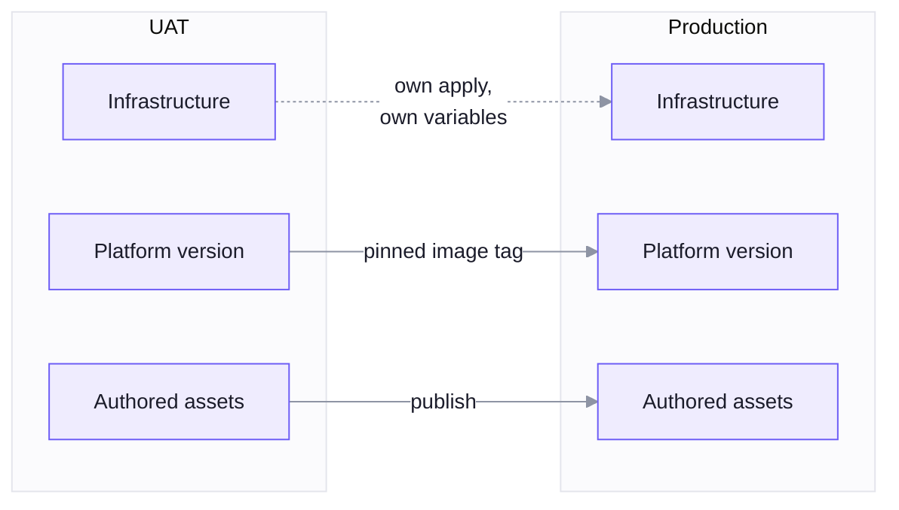

Development, UAT and production are three universes. Each is its own apply of the same
Terraform, with its own variables and its own identity provider client.

That is the whole story for infrastructure, and it is what the contract exists for.

## Promotion is three separate movements

Treating it as one button is how environments drift. It is three, and they move at different
speeds.

**Infrastructure** does not move. Each environment is provisioned independently from the
same module, so production is not a copy of UAT, it is another instance of the same
definition.

**The platform version** moves as an image tag. UAT runs a tag first and production follows
it. This requires pinned tags rather than a floating latest, so that "production runs what
UAT tested" is a fact rather than a hope.

**Authored assets** move by publishing. Components, templates, skills and prompt blocks are
rows in a universe's database, and promoting one means publishing it to the next universe.
That is the same mechanism a developer uses from **Studio**, pointed at a different address.

## What never moves

Data stays where it is. Conversations, memory, traces and credentials are properties of an
environment, not of a release.

Secrets are re-entered in production. They are never copied forward, because a secret that
has been in a test environment is a test secret.

## A gap worth knowing about

**Workflows have no promotion lane.** Components, skills and nodes are all publishable items
with a version history. Workflows are not, so moving one from UAT to production today means
rebuilding it on the production canvas.

This is a known limitation rather than a design position, and closing it is required work
for real multi-environment operation. Plan around it if your process depends on promoting
workflows rather than rebuilding them.

## Day-two operations

Once a universe is running, the routine work is small and each piece has a runbook.

| | |
| --- | --- |
| Platform upgrades | Pull new image tags and restart |
| Database migrations | Run against a live universe, forward only |
| Rolling back | Images roll back. Migrations do not, by design |
| Node inventory | Reconcile the database against what is installed |
| Backups | Provider-native, plus the **Spatial ML** models and the credential encryption key |
| Publish keys | Issued on the box, for CI and for first connection |
| Resizing | Change the size variable, apply, redeploy |

Content does not appear in that list, and that is the point. Assets reach a universe by
publishing and nodes install themselves from the record in the database, so neither one
requires a deployment.

---

**Next**: [Runbooks](../runbooks/overview.md)
