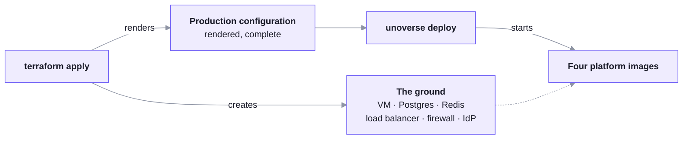

A universe's infrastructure is Terraform, and it ships with the starter kit. You read it
before you run it, you keep it in your own version control, and it creates everything in
your own cloud account.

This is the artifact to hand a security review. It is a few hundred lines, and it states
every resource, every firewall rule and every secret the platform needs.

## Two layers that never merge



**Terraform answers what exists. The deploy answers what runs on it.** The handoff between
them is one rendered environment file, and that file is complete. Nothing in it is
hand-edited afterwards.

That seam is what makes the rest cloud-blind. The images, the CLI and every runbook are
identical whichever provider you chose.

## Five inputs

The whole contract is five values, implemented once per cloud.

| Input | Values | What it decides |
| --- | --- | --- |
| `size` | `small`, `medium`, `large` | The machine, the database tiers, the backup window, the connection budget |
| `auth` | `byo-oidc`, or `cognito` on AWS | Which identity provider signs your users in |
| `domain` | A DNS name | Every HTTPS URL, and the certificate |
| `admin_email` | An email address | The first administrator, holding every role |
| `roles` | A list of `noun:verb` | The role vocabulary your nodes and workflows can demand |

Everything else has a default, including the sizes of every resource.

**Roles are provisioned only when the platform owns the identity provider.** With `cognito`,
Terraform creates the groups and puts the administrator in them, so the roles exist because
the apply ran. With `byo-oidc` your tenant is authoritative and Terraform touches none of
it, so the list is documentation rather than provisioning.

Two roles must exist in whichever provider you use, or nobody can author or publish:
`workflow:author` and `marketplace:publish`.

## What it creates

Both stacks produce the same universe. They differ only in the managed services each cloud
offers, and each has its own page.

<CardGroup cols={3}>

<Card title="Amazon Web Services" href="./aws.md">

EC2, RDS, ElastiCache, Cognito, Bedrock
</Card>

<Card title="DigitalOcean" href="./digitalocean.md">

Droplet, managed Postgres and Redis, load balancer
</Card>

<Card title="Azure" href="./azure.md">

Planned
</Card>

</CardGroup>

Firewalling lives in the cloud rather than on the box. That is deliberate: a firewall on the
VM has to contend with Docker writing its own rules, and moving the boundary into the
provider removes that whole class of surprise.

## Running it

```bash
cd infra/aws          # or infra/digitalocean
cp terraform.tfvars.example terraform.tfvars
```

Fill in the five inputs, your operator IP address, and the service credentials the platform
needs to pull images and call AI providers. Then:

```bash
terraform apply
```

The universe exists at this point but is empty. Deployment is separate (`unoverse deploy init` — it reads the rendered configuration from your applied ground itself), and it is covered in the [Runbooks](../runbooks/overview.md).

There is no wrapper command around any of this. `terraform apply` is the interface, because
a customer's platform team already knows what it does and can review what it will change
before it changes it.

## Resizing

Change `size`, apply again, redeploy. The variable moves the machine, the database tiers and
the connection budget together, which is the reason those numbers live in one place.

## What Terraform does not do

It does not install or start the platform. It does not carry your content, which reaches a
universe by publishing rather than by deployment. It does not manage your identity provider
when you brought your own.

---

**Next**: [Networking](./networking.md)
